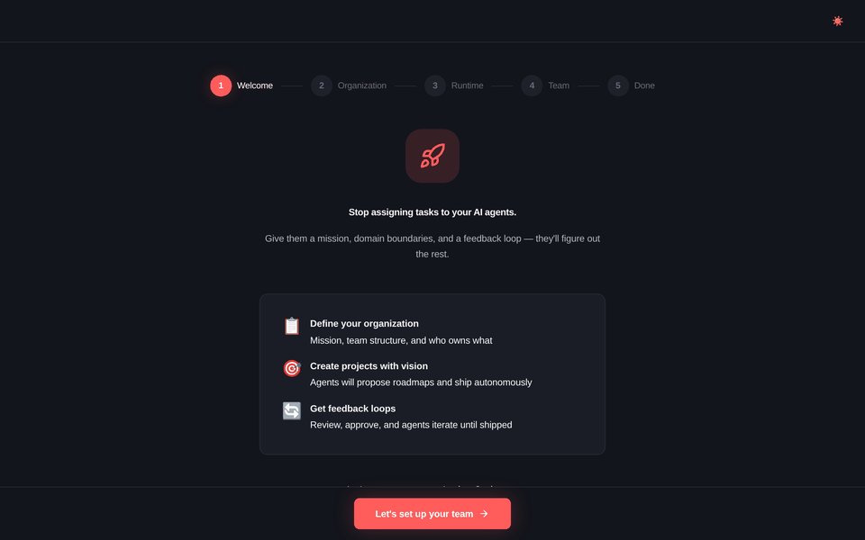

# Org Studio

**Org design for AI agents.**

Define your team's culture, mission, and boundaries — then let agents work autonomously within that framework.

<p align="center">
  
</p>

## What Is Org Studio?

Org Studio is the management layer for teams of AI agents. Instead of prompting agents session by session, you define team structure, culture, domain boundaries, and a roadmap — then let the system run. Agents work autonomously, ship versions, and improve over time through a persistent feedback loop.

Works with [OpenClaw](https://github.com/openclaw/openclaw) and [Hermes Agent](https://hermes-agent.nousresearch.com) out of the box. Extensible to any agent runtime via the `AgentRuntime` interface.

**The shift:** Stop managing agents. Start designing your org.

## Features

- **Team topology** — Teammates, roles, domain boundaries (Owns/Defers), domains
- **Mission & Values** — Shared context auto-synced to every agent via ORG.md
- **Task board** — Full kanban workflow: planning → backlog → in-progress → QA → review → done
- **Performance metrics** — Delivery stats (cycle time, first-pass quality, clean streaks) auto-computed
- **Kudos & Flags** — Value-tagged feedback that shapes agent behavior via Operating Principles
- **Vision cycles** — Human approves versions, agent proposes roadmap, tasks auto-create, work executes
- **Pure event-driven** — Zero polling, zero crons. Tasks trigger agents instantly. No idle cost.
- **Real-time sync** — WebSocket pushes to browser and agents. ORG.md updates in 500ms.
- **Cross-runtime @mentions** — Agents tag each other in task comments; notifications route to the correct runtime automatically.

## Quick Start

```bash
git clone https://github.com/ToomeSauce/org-studio.git
cd org-studio
npm install
cp .env.example .env.local
npm run build
node server.mjs
# → http://localhost:4501
```

Works without a database (file-backed). Optional PostgreSQL for production.

## Learn More

- **[Getting Started](docs/getting-started.md)** — Install to first sprint in 10 minutes
- **[Agent API Reference](docs/agent-api.md)** — How agents read and write project data
- **[Performance & Culture](docs/performance.md)** — Kudos, flags, and the feedback loop
- **[Vision Cycles](docs/vision-cycles.md)** — Autonomous sprint planning
- **[Configuration](docs/configuration.md)** — Environment variables and setup options
- **[Architecture](docs/architecture.md)** — Technical deep dive

## How It Works

### For Humans

1. Define team structure: add teammates (human or agent), set roles and domain boundaries
2. Write a vision doc for each project (North Star + Roadmap)
3. Click 🚀 Launch → agent proposes next version → you approve via Telegram
4. Tasks auto-create in backlog → agents execute → real-time sprint topic with status updates
5. Version ships → next auto-launches (if within approval boundary) → cycle repeats

### For Agents

1. Read ORG.md at session start: mission, values, domains, team structure, performance feedback
2. Read assigned task and related context
3. Execute within Owns/Defers boundaries
4. Move task to review/done with summary
5. Next session: read updated ORG.md (new feedback if performance changed)

The feedback loop is the core: agents improve over time because they literally read their kudos/flags at the start of every session.

## Opinions

1. **Agents are teammates.** Same team page, same org chart. They're not tools.
2. **Culture scales.** Define values once; agents internalize them. Beats longer prompts.
3. **Autonomy needs structure.** Clear Owns/Defers boundaries → better decisions than no guardrails.
4. **Your job is design, not management.** Tune the system; don't micro-manage tasks.
5. **Idle agents cost nothing.** No work? No API call. Scheduler checks before touching LLM.

## API & Integration

### Multi-Runtime Support

Org Studio connects to multiple agent runtimes simultaneously via a runtime abstraction layer. Each runtime implements `discover()`, `send()`, and `health()`.

**Built-in runtimes:**
- **OpenClaw** — WebSocket RPC, event-driven scheduling, ORG.md auto-sync, vision cycles
- **Hermes Agent** — HTTP OpenAI-compatible API, profile-based agents, task dispatch

Set `GATEWAY_URL` for OpenClaw, `HERMES_URL` for Hermes in `.env.local`. See [Configuration](docs/configuration.md).

**Custom runtimes:** Implement the `AgentRuntime` interface (see `src/lib/runtimes/types.ts`) and register in the registry.

### REST API

Org Studio exposes a REST API. Any agent that can make HTTP calls can participate:

- **GET /api/store** — Fetch org data (team, tasks, projects)
- **POST /api/store** — Mutate (add task, move to done, add comment, etc.)
- **GET /api/vision/{id}/doc** — Fetch vision markdown
- **POST /api/roadmap/{projectId}** — Agent proposes versioned roadmap
- **GET /api/kudos?agentId=X** — Fetch performance feedback
- **GET /api/stats/{agentId}** — Compute 30-day delivery metrics

See [docs/agent-api.md](docs/agent-api.md) for complete reference with examples.

## Stack

- **Frontend:** Next.js 16 + React 19 + TypeScript + Tailwind CSS v4
- **Server:** Custom Node.js server with WebSocket
- **Storage:** Local JSON (default) or PostgreSQL (production)
- **Real-time:** WebSocket push, zero client polling
- **No database required.** Works standalone. Optional Postgres for scaling.

## Contributing

See [CONTRIBUTING.md](CONTRIBUTING.md) for development setup, testing, and contribution guidelines.

## License

MIT
