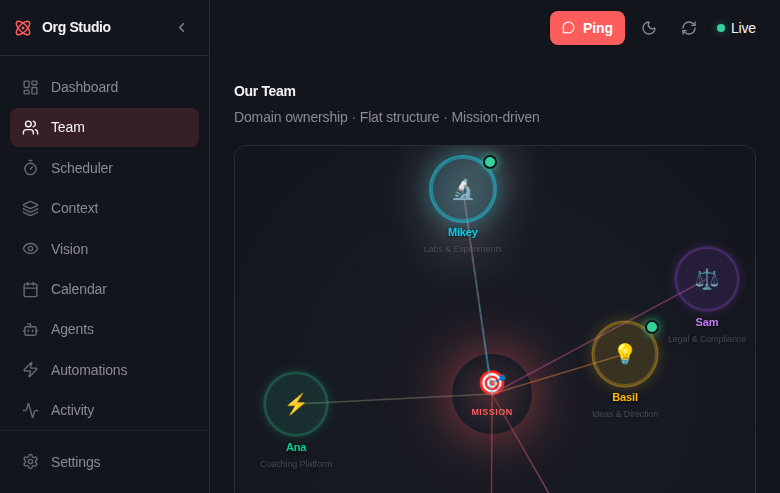

# Org Studio

**Org design and team management for hybrid human + AI agent teams.**

<p align="center">
  
</p>

Org Studio is a real-time dashboard for teams that include both humans and AI agents. It helps you visualize your org structure, define your mission and values, track tasks, and measure how autonomous your agents are becoming.

> Agents can only be autonomous if they have full context. Sharing context transparently — status, blockers, decisions — is what enables autonomy. Org Studio replaces the manager with a shared surface.

## Why Org Studio?

Most agent frameworks focus on *how agents work* (chains, tools, prompts). Org Studio focuses on *how the team works* — the organizational layer that makes agent autonomy possible.

- **Visualize your org** — Interactive Force Graph and Solar System views show your team topology in real-time
- **Define your culture** — Mission statement and customizable values framework (like PACT: People-First, Autonomy, Curiosity, Teamwork)
- **Track work** — Kanban task board with projects, assignees, and priorities
- **Measure autonomy** — Every task tracks status history and who initiated it, enabling cycle time, self-initiative rate, and intervention frequency metrics
- **Humans + agents as peers** — Same cards, same task board, same values. The only difference is a 👤 badge

## Quick Start

```bash
# Clone and install
git clone https://github.com/teampartial/org-studio.git
cd org-studio
npm install

# Set up your data (or start fresh — the app bootstraps from the example)
cp data/store.example.json data/store.json  # optional

# Configure environment
cp .env.example .env.local
# Edit .env.local if you want to connect an agent runtime

# Build and run
npm run build
node server.mjs
# → Org Studio ready on http://localhost:4501
```

## Using Without an Agent Runtime

Org Studio works out of the box as a standalone team dashboard — no agent runtime needed.

**What works immediately:**
- 🏗 **Team page** — add teammates (human or agent), set roles, domains, Owns/Defers boundaries
- ✅ **Task board** — full kanban: create, assign, move tasks through planning → backlog → in-progress → review → done
- 📋 **Projects** — group tasks into projects, track phases and ownership
- 🎯 **Mission & Values** — define your team's mission statement and cultural values
- 📝 **Memory & Docs** — browse and search workspace files
- 🧭 **Onboarding wizard** — guided first-run setup (name your org → add teammates → create first project)

**What lights up with a runtime (optional):**
- Live agent status indicators (active/idle)
- Ping panel — message agents directly from the UI
- Agent auto-discovery — new agents appear automatically
- Scheduler — autonomous agent loops that pick up tasks
- Cron job management

To connect a runtime later, set `GATEWAY_URL` and `GATEWAY_TOKEN` in `.env.local`. See [Connecting an Agent Runtime](#connecting-an-agent-runtime).

## Architecture

```
Browser  ←→  WebSocket (/ws)  ←→  server.mjs  ←→  Next.js (HTTP)
                                       ↓
                              fs.watch (store.json)  →  instant push
                              Gateway poll (8s)      →  push on change
```

- **server.mjs** — Single process: Next.js HTTP + WebSocket on port 4501
- **data/store.json** — File-backed data store (tasks, projects, teammates, values, settings)
- **REST API** — `GET/POST /api/store` for all mutations
- **WebSocket** — Push-based updates, zero client-side polling
- **Theme** — Dark/light toggle, CSS custom properties throughout

## Connecting an Agent Runtime

Org Studio works standalone for team structure, tasks, and culture. Connect an agent runtime for live status and session data.

### OpenClaw (built-in)

Set `GATEWAY_URL` and `GATEWAY_TOKEN` in `.env.local`. Live agent status, cron jobs, and session data appear automatically.

### Any Framework (REST API)

Any agent that can make HTTP calls can report status:

```bash
# Report agent activity
curl -X POST http://localhost:4501/api/activity-status \
  -H "Content-Type: application/json" \
  -d '{"agent":"my-agent","status":"Processing documents","detail":"Batch 3 of 10"}'

# Clear status
curl -X DELETE http://localhost:4501/api/activity-status \
  -H "Content-Type: application/json" \
  -d '{"agent":"my-agent"}'
```

## Store API

All data mutations go through `POST /api/store`:

| Action | Payload | Description |
|--------|---------|-------------|
| `addTask` | `{task: {...}}` | Create a task |
| `updateTask` | `{id, updates: {...}}` | Update task (status changes auto-tracked) |
| `deleteTask` | `{id}` | Delete a task |
| `addProject` | `{project: {...}}` | Create a project |
| `updateProject` | `{id, updates: {...}}` | Update a project |
| `deleteProject` | `{id}` | Delete a project |
| `addTeammate` | `{teammate: {...}}` | Add a team member |
| `updateTeammate` | `{id, updates: {...}}` | Update a team member |
| `removeTeammate` | `{id}` | Remove a team member |
| `updateSettings` | `{settings: {...}}` | Update settings (mission, node physics, etc.) |
| `updateValues` | `{values: {name, items: [...]}}` | Update cultural values |

## Performance Tracking

Every task automatically tracks:
- **statusHistory** — Array of `{status, timestamp}` entries, appended on every status change
- **initiatedBy** — Who created the task (human or agent ID)

This enables:
- **Cycle time** — How long from start to done
- **Rework rate** — Tasks that move backward
- **Self-initiative rate** — % of tasks agents created themselves
- **Zero-touch rate** — % of tasks completed without human intervention

## Agent Scheduler

The scheduler turns Org Studio from a passive dashboard into an active orchestrator. It manages autonomous agent work loops — agents wake up, check for work, execute it, and go back to sleep.

### How It Works

```
Task added to backlog
       ↓
Store API → triggerAgentLoop()     ← event-driven, instant
       ↓
Scheduler API (trigger action)
       ↓
Pre-flight gate: does agent have    ← no work = no LLM call = $0
actionable work?
       ↓ yes
Fire one-shot cron job
       ↓
Agent wakes, reads tasks, works     ← full autonomous loop
them, moves to done/review
       ↓
Agent returns summary (announced)
or HEARTBEAT_OK (silent)
```

### Three Modes of Execution

| Mode | When | Cost |
|------|------|------|
| **Event-driven trigger** | Task lands in an agent's backlog | 1 LLM call per trigger (with 60s cooldown) |
| **Manual (Run Now)** | User clicks "Run Now" in the UI | 1 LLM call on demand |
| **Scouting heartbeat** | Recurring cron (default: every 4 hours) | 0 if idle (pre-flight gate), 1 if work found |

### Scheduler API

`POST /api/scheduler`:

| Action | Payload | Description |
|--------|---------|-------------|
| `enable` | `{loopId}` | Create a recurring cron job for the loop |
| `disable` | `{loopId}` | Remove the cron job and disable the loop |
| `runNow` | `{loopId}` | Force-trigger the loop immediately |
| `trigger` | `{agentId}` | Event-driven trigger (called by store API) |
| `sync` | — | Reconcile store ↔ Gateway cron state |
| `runHistory` | `{loopId, limit?}` | Fetch recent run history |

### Prompt Architecture

Each loop generates a structured prompt with:

1. **Global preamble** — Shared instructions for all agents (configurable in UI)
2. **Loop identity** — Agent name and loop context
3. **Per-loop system prompt** — Optional override for specialized behavior
4. **Default steps** — Configurable step sequence (check tasks → work → report)
5. **Task management** — Full API reference for the store, column workflow, priority rules
6. **Rules** — Domain boundaries, branch restrictions, status reporting
7. **Exit protocol** — Write to daily memory file, return summary or `HEARTBEAT_OK`

### Idle Suppression

When an agent runs and finds no work:
- Returns `HEARTBEAT_OK` (treated as silent ack, not announced)
- Does NOT write to memory (nothing happened)
- Does NOT send any notification

This prevents notification spam from recurring heartbeat runs.

### Pre-flight Gate

Before spawning an LLM session, the scheduler checks the store for tasks assigned to the agent in `backlog` or `in-progress`. If none exist, the LLM call is skipped entirely — zero tokens consumed.

### Event-Driven Triggers

The store API (`/api/store`) fires triggers automatically when:
- A new task is added with status `backlog`
- An existing task is moved to `backlog` or reassigned while in `backlog`

Triggers include a 60-second per-agent cooldown to prevent rapid-fire when multiple tasks are added in sequence.

### Configuration

Loops are stored in `data/store.json` under `settings.loops[]`:

```json
{
  "id": "loop-abc123",
  "agentId": "mikey",
  "intervalMinutes": 240,
  "model": "github-copilot/claude-opus-4.6",
  "enabled": true,
  "cronJobId": "uuid-from-gateway",
  "steps": [
    { "type": "check", "description": "Fetch assigned tasks", "enabled": true },
    { "type": "work", "description": "Execute highest priority task", "enabled": true },
    { "type": "report", "description": "Summarize and update status", "enabled": true }
  ],
  "systemPrompt": null
}
```

### ORG.md Auto-Sync

When `store.json` changes, `server.mjs` auto-generates personalized `ORG.md` files for each agent's workspace (within 500ms). These contain org context — mission, values, domain boundaries, and team info — that agents read at the start of each loop.

## Stack

- Next.js 16, React 19, TypeScript
- Tailwind CSS v4 with CSS custom properties
- Geist font (sans + mono)
- WebSocket via `ws` library
- File-backed JSON store (no database required)

## License

MIT
